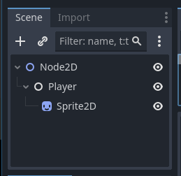

For a question asked on the [godot-rust](https://github.com/godot-rust/gdext) Discord forum about the Hello World tutorial not working: https://discord.com/channels/723850269347283004/1192118392660963338/threads/1193018277560066058 

The solution was to set my nodes up like this:
 
